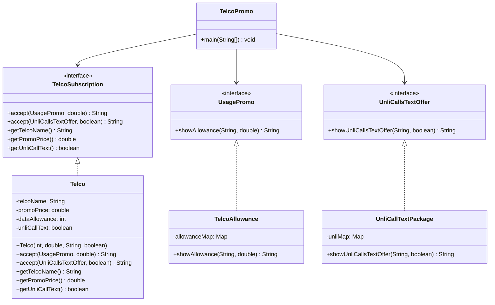

# Visitor-Pattern

## Visitor Pattern UML Diagram

## Problem Scenario

Visitor Design Pattern – Telco Promo System
Problem Scenario

Three major telecommunication providers are offering different promotional mobile plans:

Smart

15 GB data for ₱500 per month

No free calls and texts

Calls and texts are charged per use

Globe

10 GB data for ₱450 per month

Unlimited calls and texts within Globe network only

Calls and texts to other networks are charged extra

Dito

8 GB data for ₱400 per month

Unlimited calls and texts to all networks nationwide

The system must display:

Data allowance and price offer

Unlimited call and text offer

To separate operations from the object structure, the Visitor Design Pattern is used.

Design Pattern Used: Visitor Pattern

The Visitor Pattern allows adding new operations to existing object structures without modifying those structures.

✔ Element

TelcoSubscription (interface)

✔ Concrete Element

Telco

✔ Visitors

UsagePromo

UnliCallsTextOffer

✔ Concrete Visitors

TelcoAllowance

UnliCallTextPackage

✔ Client

TelcoPromo
